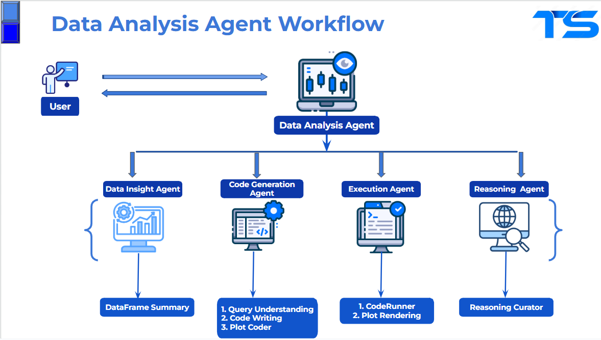

# TS Data Analysis Agent

An interactive, agentic data analysis application that leverages advanced LLM reasoning to help users explore, visualize, and understand their data using **NVIDIA Llama-3.1-Nemotron-Ultra-253B-v1** and **NVIDIA Llama-3.3-Nemotron-Super-49B-v1.5**.
***

## Overview

This repository contains a **Streamlit** application that demonstrates a complete workflow for data analysis:
1.  **Data Upload**: Upload CSV files for analysis.
2.  **Natural Language Queries**: Ask questions about your data in plain English.
3.  **Automated Visualization**: Generate relevant plots and charts.
4.  **Transparent Reasoning**: Get detailed explanations of the analysis process.

The implementation leverages the powerful Llama-3.1-Nemotron-Ultra-253B-v1 and Llama-3.3-Nemotron-Super-49B-v1.5 models through NVIDIA's API, enabling sophisticated data analysis and reasoning.

***

## Features

-   **Agentic Architecture**: Modular agents for data insight, code generation, execution, and reasoning.
-   **Natural Language Queries**: Ask questions about your data—no coding required.
-   **Automated Visualization**: Instantly generate and display relevant plots.
-   **Transparent Reasoning**: Get clear, LLM-generated explanations for every result.
-   **Powered by NVIDIA Llama-3.1-Nemotron-Ultra-253B-v1** and **NVIDIA Llama-3.3-Nemotron-Super-49B-v1.5**: State-of-the-art reasoning and interpretability.



***

## Requirements

-   Python 3.10+
-   Streamlit
-   NVIDIA API Key
-   Required Python packages:
    -   `pandas`
    -   `matplotlib`
    -   `streamlit`
    -   `requests`
    -   `openai`
    -   `watchdog`

***

## Installation

1.  Clone this repository:
    ```bash
    git clone https://github.com/Thireshsidda/Data_Analysis_Agent.git
    cd Data-Analysis-Agent
    ```
2.  Install dependencies:
    ```bash
    pip install -r requirements.txt
    ```
3.  Set up your NVIDIA API key:
    -   Sign up or log in at [NVIDIA Build](https://build.nvidia.com/nvidia/llama-3_1-nemotron-ultra-253b-v1?integrate_nim=true&hosted_api=true&modal=integrate-nim).
    -   Generate an API key.
    -   Set the API key in your environment or a `.env` file. On Linux/macOS, you can use:
        ```bash
        export NVIDIA_API_KEY=your_nvidia_api_key_here
        ```

***

## Usage

1.  Run the Streamlit app:
    ```bash
    streamlit run data_analysis_agent.py
    ```
2.  Download example dataset (optional):
    ```bash
    wget https://raw.githubusercontent.com/datasciencedojo/datasets/master/titanic.csv
    ```
3.  Use the application:
    -   Select a model from the dropdown menu.
    -   Upload a CSV file (e.g., the Titanic dataset).
    -   Ask questions in natural language.
    -   View results, visualizations, and detailed reasoning.

***

## Deployment with GitHub Actions (CI/CD)

This project is set up to automatically deploy to Hugging Face Spaces using GitHub Actions. Any changes pushed to the `main` branch will trigger a deployment.

### How to set up the workflow

1.  **Get your Hugging Face Token**:
    -   Go to [Hugging Face](https://huggingface.co/) > **Settings** > **Access Tokens**.
    -   Create a new token with **write** access and copy it.

2.  **Add the token as a GitHub Secret**:
    -   In your GitHub repository, navigate to **Settings** > **Secrets and variables** > **Actions**.
    -   Click **New repository secret**.
    -   Name the secret `HUGGINGFACE_TOKEN`.
    -   Paste your Hugging Face token into the `Secret` field and click **Add secret**.

3.  **Push the workflow file**:
    -   Ensure you have the `.github/workflows/ci-cd.yml` file in your repository. [Source](https://huggingface.co/docs/hub/spaces-github-actions)
    -   The workflow will automatically run on every `git push` to the `main` branch.

***

## Example


***

## Models Details

The **Llama-3.1-Nemotron-Ultra-253B-v1** model used in this project has the following specifications:
-   **Parameters**: 253B
-   **Features**: Advanced reasoning capabilities
-   **Use Cases**: Complex data analysis, multi-agent systems
-   **Enterprise Ready**: Optimized for production deployment

The **Llama-3.3-Nemotron-Super-49B-v1.5** model used in this project has the following specifications:
-   **Parameters**: 49B
-   **Features**: Efficient reasoning and chat model
-   **Use Cases**: AI Agent systems, chatbots, RAG systems, and other AI-powered applications. Also suitable for typical instruction-following tasks.
-   **Enterprise Ready**: Optimized for production deployment

***

## Acknowledgments

This project is built upon the foundational work and public examples provided by **NVIDIA**. We extend our gratitude for their contributions to the open-source community.

-   [NVIDIA Llama-3.1-Nemotron-Ultra-253B-v1](https://build.nvidia.com/nvidia/llama-3_1-nemotron-ultra-253b-v1)
-   [NVIDIA Llama-3.3-Nemotron-Super-49B-v1.5](https://build.nvidia.com/nvidia/llama-3_3-nemotron-super-49b-v1_5)
-   [Streamlit](https://streamlit.io/)
-   [Pandas](https://pandas.pydata.org/)
-   [Matplotlib](https://matplotlib.org/)

***

## Contributing

Contributions are welcome! Please open an issue or submit a pull request.
